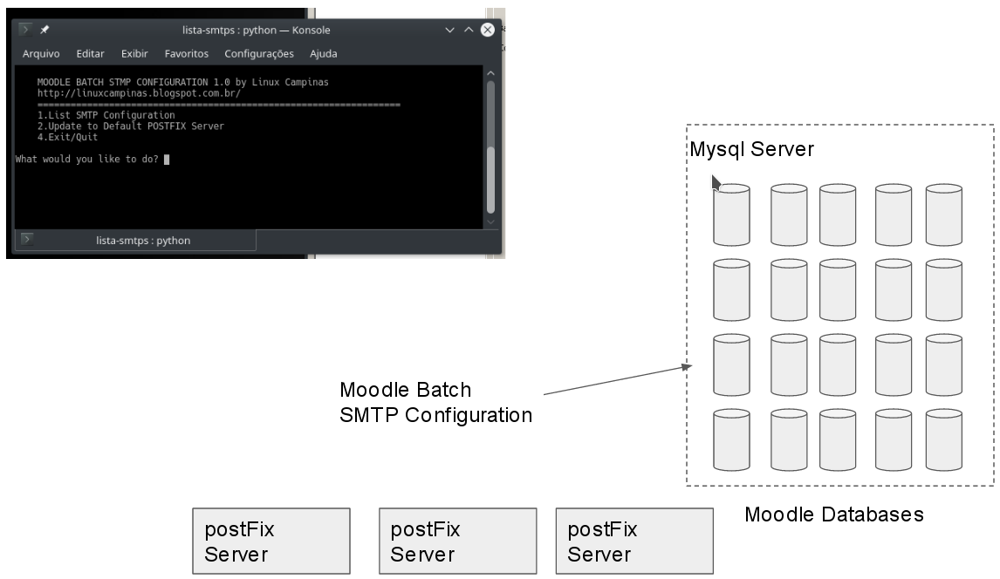

# MOODLE BATCH STMP CONFIGURATION
Tool to update smtp settings in all moodle database servers on a Mysql Server

For example, if  you have one or more mysql servers with many moodle databases and need to update all smtp configuration automatically.
It is so usefull when you have to admin many servers with many moodle instalations and needs to update all of them with some regularity.

example of output

    MOODLE BATCH STMP CONFIGURATION 1.0 by Linux Campinas
    http://linuxcampinas.blogspot.com.br/
    ==================================================================
    1.List SMTP Configuration
    2.Update to Default POSTFIX Server
    4.Exit/Quit
    
    What would you like to do? 
 
 
 <h2>Diagram of use</h2>

# HOW TO USE

1)git clone https://github.com/fabioalvaro/MOODLE-BATCH-STMP.git

$ cd MOODLE-BATCH-STMP

2)$sudo chmod +x ./lista-postfix.py

3)run it:  $ sh ./lista-postfix.py

4)COnfigure the file settings.ini

4)First run the List option #1 see the summary to check

5)Run the second option to update the databases

